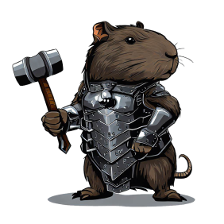

# Forja Pro - Webpage

Welcome to the repository of Forja Pro's Webpage!

## Description

Forja is a platform that aims to help programmers in a Discord community to enhance their skills, share knowledge, and collaborate on projects. This is the official implementation of the Forja Pro Webpage, built with Next.js, Tailwind CSS, and Storybook.

## Features

- **Next.js**: A React framework with server-side rendering (SSR) and static site generation (SSG) support.
- **Tailwind CSS**: A highly customizable CSS utility library that allows for rapid development of modern and responsive interfaces.
- **Storybook**: A development environment for isolated components, enabling you to create, view, and test each project component interactively.

## Running the Project

Make sure you have Node.js and npm (or yarn) installed on your machine.

1. Clone this repository to your local environment using the following command:
   git clone https://github.com/forjadev/mjo-forja-webpage

2. Navigate to the project directory:
   cd mjo-forja-webpage

3. Install the project dependencies:
   yarn or npm install

4. Start the development server:
   yarn dev or npm run dev

5. Access the application in your browser through the URL: `http://localhost:3000`

## Storybook

To view and test individual components, you can start the Storybook environment:
yarn storybook or npm run storybook

Access Storybook in your browser through the URL: `http://localhost:6006`

## Contributing

Feel free to submit suggestions, report issues, or contribute code to enhance the Forja Webpage.

## License

This project is licensed under the MIT License. See the LICENSE file for more details.

---

Thank you for your interest in Forja Community! We hope this platform becomes a valuable resource and inspires a collaborative community of learning and growth for programmers. Your participation is crucial in making this vision a reality.

For more information about the Forja project, visit our [official website](https://forja.com) or join our [Discord community](https://discord.gg/HyzQcqKQ).

Let's forge knowledge and friendships together! 🛠️🚀
